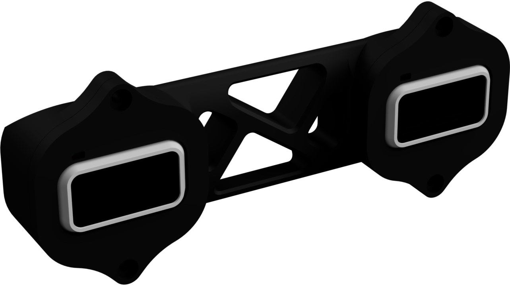

# OpenDrone

Idee: OpenDrone este un prototip pentru o drona autonoma de cost scazut.
Aceasta este facut din doua sisteme diferite: Drona + Sistem de
Localizare.

### Sistemul de localizare

Localizarea se face pe baza unui algoritm de visual stereo odometry.
Aceast metoda consta in combinarea datelor primite de la doua camere
pentru a urmari miscarea in spatiu astfel reusind sa obtinem un Δx, Δy,
Δz fata de punctul in care algoritmul incepe.

#### Partea Mecanica

Toate elementele dronei si a sistemului de localizare care nu sunt
electronice au fost printate si construite in mediu 3D prin aplicatia
Fusion 360.

Camera Stereo -\> o camera stereo este un sistem de doua camere paralele
pe care le putem folosi sa "vedem lumea in 3D" ca si atunci cand un om
cu doi ochi observa "adancimea" imaginilor primite de la ochi.

Pentru acesta folosim doua camere accesebile Microsoft LifeCam 3000
pentru care prinderea a trecut prin mai multe iteratii.

##### MK1

-   Era foarte mare si greu

-   Camerele nu stateau destul de fixe

##### MK2

Folosind doar circuitul integrat al camerei + lentila putem sa facem
camera mult mai usoara si compacta. PCBurile ne dau si o metoda de
prindere mai fixa a camerei.

Pentru procesarea imaginilor primite de la camera prezentam 2 variante:
sitemul de localizare scris de mine folderul "Regional_OpenOdoCam" si
libraria open-source ORB_SLAM3.

Cum functioneaza codul? - Regional_OpenOdoCam

I.  Cu ajutorul librariei OpenCV obtinem imaginile pe care le
    > transformam in alb negru pentru procesare mai rapida si le
    > impartim intr-un grid pentru a putea desparti procesarea pe mai
    > multe threaduri

II. Extragerea de "featureuri" se face cu ajutorului algoritmului
    > FAST(Features from Accelerated Segment Test). Acest algoritm ajuta
    > la detectarea colturilor dintr-o imagine care pot fi urmarite
    > intre frameuri, observand pixelii care sunt ori mai luminosi ori
    > mai intunecati ca celelalte elemente din jurul lor (codul pentru
    > feature detection se poate gasi in fisierul feature.cpp, functia
    > featureDetectionFast())

III. Pentru urmarirea miscarii acestor featureuri in imagine se
     > foloseste functia de calculare a flowului optic in imagine din
     > OpenCV astfel reusind sa se gaseasca acelasi feature in cele doua
     > imagini de la timpul prezent si cele doua precedente(functia
     > circularMatching()).

IV. Triangulam punctele gasite in spatiu folosind matricea de proiectie
    > a camerelor cu ajutorul OpenCV

V.  Dupa triangularea punctelor ne folosim de un algoritm numit
    > Perspective-n-Point Ransac. Ransac este un algoritm iterativ de
    > aproximarea a unei functii, in acest caz fiind functia de
    > transformare a matricei de rotatie si cea de translatie.

VI. In final aplicam matricile de rotatie si translatie obtinute de la
    > PnP-Ransac la pozitia precedenta pentru a afla pozitia actuala

Totusi cu aceast algoritm sunt cateva probleme. Functia de
calcOpticalFlowPyrk() este prea inceata mai ales ca trebuie folosita de
4 ori dupa fiecare loop astfel codul poate rula doar la 2-3FPS pe un
laptop performant cu Ryzen 7. Nu exista nicio varianta de relocalizare.

Pentru rezolvarea acestor probleme m-am intors catre o librarie
open-source numita ORB_SLAM3. Aceasta poate rula in timp real si pe
calculatoare mai putin performante si in acelasi timp foloseste un
algoritm mai complex de feature matching numit ORB si prezinta mai multe
feature-uri precum loop-closing, Simultaneous localization and mapping
si crearea unei harti din punctele triangulate.

Am modificat codul sursa al librariei pentru a putea face rost de
pozitia camerei si a procesa cu usurinta imaginile cu orice tip de
camera stereo creata de un utilizator.

Pentru a putea rula acest program pe o drona avem nevoie de un
calculator mic, usor si cu multa putere de procesare. Pentru acesta
folosim un Intel NUC(NUC8i3BEK) cu o carcasa custom printata 3d care a
trecut prin mai multe iteratii pentru a ajunge la o varianta de 3 ori
mai usoara si de 2 ori mai compacta decat cea originala.

##### Carcasa originala

-   Grea

-   Mult spatiu gol inauntru

-   Multe piese metalice care nu sunt necesare

##### MK1

-   Mult mai usoara ca varianta originala

-   Modalitate de a prinde camera

-   Inca este voluminoasa

-   Nu are metode de prindere de drona

##### MK2

-   Foarte compact

-   Sistem de cooling eliberat

-   Foarte usor

-   Camera stereo integrata

-   Integrare usoara cu drona

### Drona

Pentru drona am decis sa folosesc un frame standard F450 pentru
stabilitate [, pentru ca e open source si pentru ca poate fi complet
printat 3D]{.mark}.

#### Motoarele

Pentru a face drona sa zboare folosim Motoare BLDC de 1000kv pe care
le-am testat impreuna cu o elice 1045 pentru mai multe tensiuni si
curenti pentru a afla de ce baterie as avea nevoie.

Pana la urma am decis sa omit bateria cu totul pentru ma concentra pe
procesul de construire a dronei fara a pierde timp pentru incarcare.
Astfel folosesc o sursa de calculator de 500W cu iesirea de 12V.

Astfel la 12V cu 4 motoare 1000kV drona are un raport de ridicare de
2:1, unul perfect pentru o drona de interior.

Pentru pastrarea dronei in aer folosesc un senzor cu giroscop si
accelerometru MPU6050 conectat la un Arduino Nano pentru procesarea
datelor si a algoritmilor PID pentru stabilizare a dronei. Prin giroscop
aflam viteza de rotatie actuala pe care o integram in rotatia actuala,
iar prin accelerometru aflam acceleratiile externe ca acceleratia
gravitationala pentru a afla unghiul la care se afla drona. Deoarece
accelerometrul reda date cu foarte multe sunete aplicam un complimentary
filter prin care dam mai multa putere de schimbare giroscopului catre
outputul final folosind formula:

***angle = (last_angle + Δgyroscope_reading) \* 0.98 +
Δaccelerometer_reading \* 0.02***

Aloritmul PID este scris manual si urmeaza standardele algoritmilor pid
industriali cu un update rate de 250Hz. Acesta urmeaza flowul gasit in
imaginea alaturata si codul se poate gasi in folderul "drone testing".

Una dintre problemele pe care le-am intampinat este nivelul de zgomot
primit de la accelerometru din cauza vibratiilor mecanice de la drona.
Acest zgomot incurca foarte mult algoritmul de PID deoarece derivata
functiei este dependenta de nivelul de zgomot al erorii. Astfel deoarece
derivata este defapt variatia erorii unghiului, aceasta este echivalenta
cu viteza de rotatie primita separat de la giroscop. De aceea folosim
doua controllere PID separate impartite intr-unul PI care analizeaza
eroarea unghiului si un P controller care simuleaza derivata celuilalt
controller.

Arduinoul trimite semnale PWM catre ESC-uri(electronic speed controller)
pentru a controla precis viteza acestuia.

Pentru comunicarea intre sistemul de localizare si drona folosim
interfata de Serial prin USB cu o viteaza de 115200 Bits/s pentru a
transmite pozitia catre arduino. Interfata serial este deja integrata in
arduino dar pentru NUC folosim libraria de C++ CppSerial.
